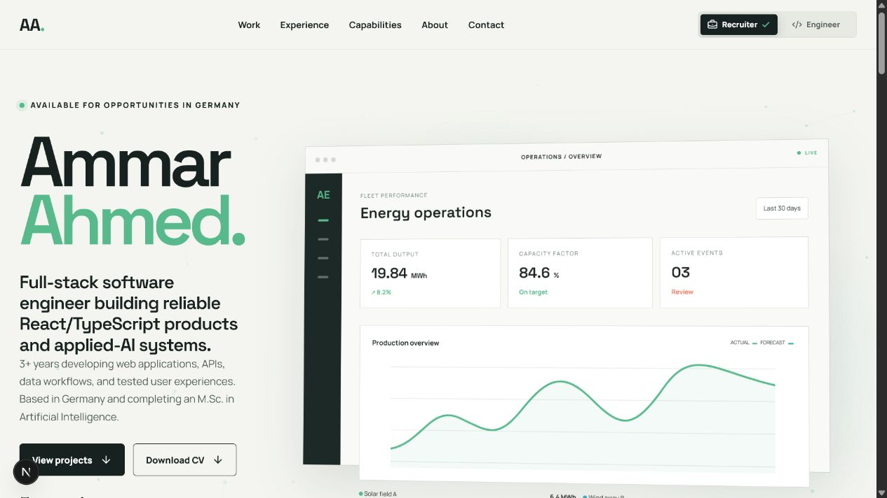

# Ammar Ahmed — Portfolio

A responsive, production-focused portfolio presenting Ammar Ahmed's full-stack engineering experience, technical capabilities, and applied-AI projects. The interface includes dedicated recruiter and engineer views so visitors can choose the level of product or technical detail they need.



## Highlights

- Recruiter and engineer viewing modes with clear selected states
- Detailed case studies for the AI Energy Data Analyst and AI Research Assistant
- Responsive layouts and accessible keyboard interactions
- Purposeful motion with reduced-motion support and offscreen animation pausing
- Optimized images, typed components, and automated quality checks

## Technology

- Next.js 15 and React 19
- TypeScript
- Tailwind CSS 4
- Jest and React Testing Library
- ESLint and Prettier

## Local development

Node.js 20 or later is required.

```bash
npm install
npm run dev
```

Open [http://localhost:3000](http://localhost:3000) in your browser.

## Quality checks

```bash
npm run typecheck
npm run lint
npm test
npm run format:check
npm run build
```

## Production

Create an optimized production build and run it locally:

```bash
npm run build
npm start
```

## Author

**Ammar Ahmed** — Full-stack software engineer based in Germany.

- [GitHub](https://github.com/ammar081)
- [Portfolio](https://ammar-ahmed-portfolio.onrender.com/)
